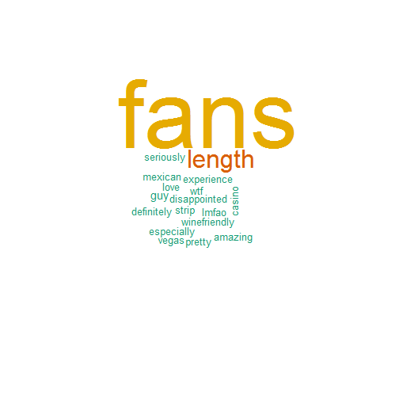

Predicting the "funnyness" and "coolness" of Yelp reviews
========================================================
author: marrakesh1400
date: 11/20/2015
font-family: 'Risque'

Why?
========================================================
transition: rotate
What makes a Yelp review *funny* or *cool* and can we predict the number of funny and cool votes that they receive?

In this study, I use text mining and data modeling methods in R to figure out why some Yelp reviews are just so popular.

Who cares?
- Reviewers who would like to have their reviews read. With so many reviews for popular businesses, readers may be more likely to read a review which has been highly rated.
- Businesses who would like to be perceived as a fun/cool place to eat, shop, drink or just chill out.

How?
========================================================
transition: rotate
This study used data from the 6th Yelp Dataset Challenge containing data on more than 1.5 million reviews, 61,000 businesses, and 370,000 reviewers.
***
The text mining leveraged the powerful *tm* R library that slices, dices and tallies the body count in your text files (and PDFs, emails, or whatever else you may to analyze). 
***
Data modeling leaned on linear regression modeling, decision trees, Random Forests and other statistical goodies from the *caret* package. 

Say what?
========================================================
transition: rotate
<small>Modeling showed that occurrences of key words and related metrics explained about 20% of funnyness and coolness. See below for the best related terms/qualities for "funnyness".</small>

  
Come again?
==========================================================
Predicting funnyness and coolness, however, did not go quite as well as planned. Decision trees and Random Forests failed to predict funnyness or coolness with any skill.
***
### So...
future modeling efforts must incorporate phrases and word associations - here, only individual words were used. Capturing such emotions in Yelp reviews is a tricky business!

